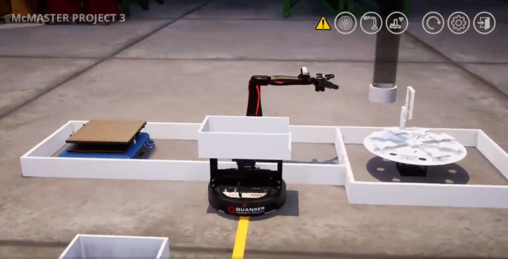
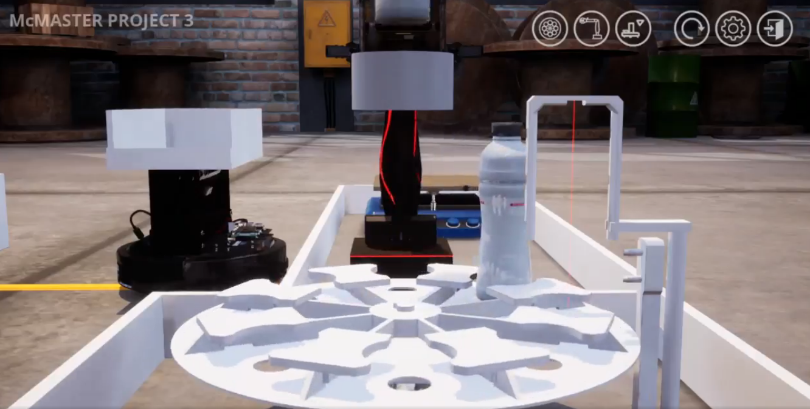
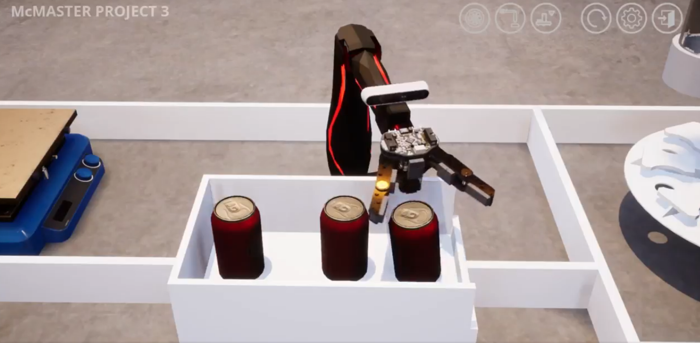
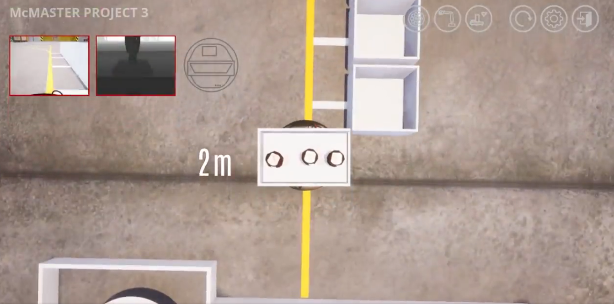
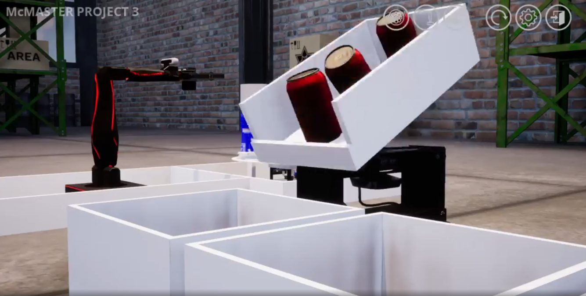

# System for Sorting and Recycling Containers - Project 3

## Table of contents

- [Overview](#overview)
  - [The challenge](#the-challenge)
  - [Screenshot](#screenshot)
- [My process](#my-process)
  - [Built with](#built-with)
  - [Code snippets](#code-snippets)
  - [What I learned](#what-i-learned)

## Overview

### The challenge

- Develop a system that can efficiently sort recyclables and transfer them to corresponding bins. Using Python create a program that can control robotic devices by connecting to a raspberry py and using a remote environment (Quanser Labs).
- Use the Q-arm and the Q-bot to transfer the containers in their appropiate bins.

### Screenshot

#### Both Q-Bot and Q-Arm at Loading Position

#### Random Container Dispensed From the Tube

#### Q-Arm Loads the Containers Being Dropped at the Same Bin

#### Q-Bot Transfers the Container to its Appropiate Bin Using an Ultrasonic Sensor

#### Q-Bot Engages the Hopper to Drop the Containers



## My process

### Built with

- Python: Functions, conditionals, and loops.
- Q-Arm and Q-Bot (ground robot) methods (common_libraries folder) used to move both robotic devices.
- Ultrasonic sensor modules (common_libraries folder) provided to track the final bin distance.

### Code snippets

#### Code to Determine the Bin Location of a Dispensed Container
```python
  while (True):
      #Tracks the total mass of the containers
      total_mass = 0

      #Dispenses and loads the first container
      while (True):
          #Stores the information of the dispensed container (material, bin destination)
          container_list = []

          #Stores the bin ID of the first loaded container
          first_loaded_container = []

          #Checks if this is the first or second time a container is loaded to transfer 
          if (deposit_counter >= 1):

              #Stores the bin ID of the container which is not loaded
              first_target_bin = next_container[len(next_container)-1]
          else:

              #Dispenses a random container as this is the first time
              container_properties = my_table.container_properties(random.randint(1,6))
              container_list.append(container_properties)
              my_table.dispense_container()

              #Stores the bin ID from the container properties (material,mass,bin destination)
              for properties in container_list:
                  total_mass = properties[1]
                  first_target_bin = properties[2]

          print("First Target Bin:  ", first_target_bin)

          #Checks if dispensed container matches bin ID
          if (first_target_bin == "Bin01"):
              bin_ID = "Bin01"
          elif (first_target_bin == "Bin02"):
              bin_ID = "Bin02"
          elif (first_target_bin == "Bin03"):
              bin_ID = "Bin03"
          elif (first_target_bin == "Bin04"):
              bin_ID = "Bin04"
```            
#### Q-Arm Code to Pick Up First Dispensed Container using Determined XYZ Coordinates
```python
  #Loads the first container on the Q-Bot
  if (first_target_bin == bin_ID and total_mass < 90):
      #Appends the containers bin ID to compare with second dispensed container
      first_loaded_container.append(bin_ID) 
      arm.move_arm(0.68, 0.0, 0.2496)
      arm.control_gripper(45)
      arm.move_arm(0.2256, 0.0, 0.1898)
      arm.move_arm(-0.11, -0.300, 0.6)
      arm.move_arm(-0.11, -0.44, 0.39)
      arm.control_gripper(-45)
      arm.rotate_elbow(-33)
      arm.home()
      break
  else:
      break
```

#### Q-Bot Code to Transfer the Loaded Container using the Ultrasonic Sensor 
```python
  bot.activate_ultrasonic_sensor()

  #Checks if the loaded container matches bin ID and assigns a sensor value
  if (transfer_location == "Bin01"):
      bin_ID = "Bin01"
      #Value collected from ultrasonic reading which indicates when the Q-Bot should stop for each bin
      bin_target_location = [0.1]

  elif (transfer_location == "Bin02"):
      bin_ID = "Bin02"
      bin_target_location = [0.15]

  elif (transfer_location == "Bin03"):
      bin_ID = "Bin03"
      bin_target_location = [0.20]

  elif (transfer_location == "Bin04"):
      bin_ID = "Bin04"
      bin_target_location = [0.24, 0.25]

  if(transfer_location  == bin_ID):
      #While loop which runs until the target bin is located using ultrasonic sensor
      #Follows the yellow line until it arrives at target bin
      lines = 0
      while(lines < 2):
          lines, velocity = bot.follow_line(0.07)
          bot.forward_velocity(velocity)
          ultrasonic_reading = bot.read_ultrasonic_sensor(bin_ID)

          #Checks if assigned bin locations match the sensor values to stop the Q-Bot
          if(ultrasonic_reading in bin_target_location):

              #Stops the Q-Bot parallel to the bin
              bot.stop()
              bot.deactivate_ultrasonic_sensor()
              print("Reached target bin...")
              time.sleep(1)
              print("Deposit Container...")
              break
          else:
              #Moves Q-Bot forward until target location is determined
              bot.forward_speed(0.06)
```

### What I learned

From this challenge I strengthened my knowledge of Python computation and scripting. Moreover, I learned more about python functions and also developed my abilities to resolve any bugs or issues within the program. 
